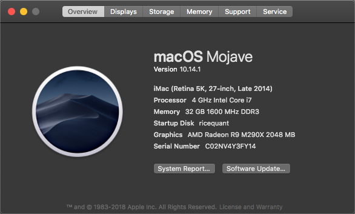

# rust-algorithms

> 本项目还在施工中...

所有排序使用的数据为(0, 10000)的`i32`类型数字.如果你对于下面某些排序有疑问,可以去[www.cs.usfca.edu](https://www.cs.usfca.edu/~galles/visualization/ComparisonSort.html)以动画形式查看各种排序,非常简单易懂.

测试机器性能:



## 冒泡排序

> 根据相邻数据的大小来交换位置.这是最慢的排序算法.

**空间复杂度: O(n^2); 时间复杂度: O(1); 稳定**

实现了三种冒泡方式,每次都以上一次进行优化:

- 默认冒泡
- 优化1 (若一次冒泡没有元素进行交互位置,那么说明已经排序好了)
- 优化1+2 (在1优化的前提下记录上次交互元素的位置,下一次循环到这个元素位置即可)

```
bubble  take time PT6.919733701S
bubble1 take time PT6.687554709S
bubble2 take time PT6.535498605S
```

可见优化后差距并不大,总体都在6.5秒之间.但是数据量提升一个数量级后时间会增加很多,比如(0,100000)的数据量使用冒泡是非常久的.

## 选择排序

> 选择排序顾名思义,选择一个当前数组中最小(或最大)的数据.左部分为已排序,右部分为未排序.每一步都选取未排序中最小(或最大)数据放入未排序部分的最左边,直至未排序数组为空.

**空间复杂度: O(n^2); 时间复杂度: O(1); 不稳定**

实现了两种选择排序方式:

- 默认选择:一次循环中寻找到一个最小(或最大)的值放到左边.
- 优化1:一次循环中寻找其中最大和最小的值,最小的值放到当前循环的左边,最大值放到当前循环的右边.

```
select take time PT4.120143050S
select1 take time PT3.074074023S
```

其中优化1中需要注意三点:

- left == max && right == min
- left == max
- right == min

可见选择排序比冒泡快了不少,不过还不够理想.

## 插入排序

> 插入排序是非常接近生活中的排序算法,此算法将待排序数组分为左右两部分,左部分为已排序,右部分为未排序.每一步取出一个待排序数据,将此数据与左部分已排序数据对比插入到合适位置,直至右部分为空.

**空间复杂度: O(n^2); 时间复杂度: O(1); 稳定**

```
insert take time PT5.840068629S
```

插入排序没有特别有用的优化方式,因此并没有记录研究.
